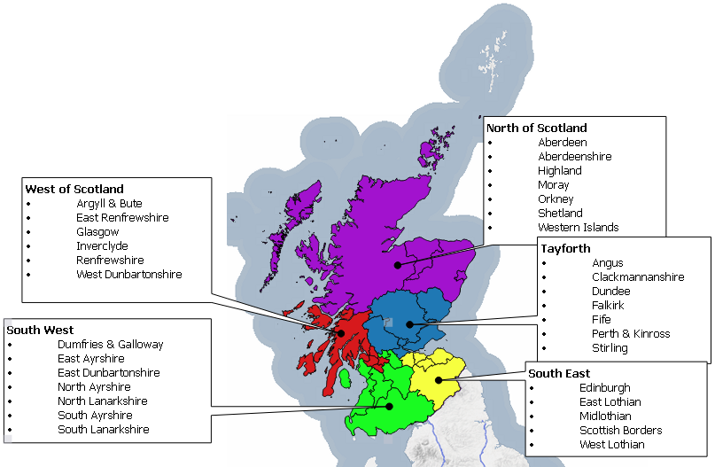

{width=675px}

###    `r params$council` Gazetteer

##    OSG Performance and Health Check Report - `r params$date`

##    Avais Ijaz - OSG Custodian

\newpage 

# Background

The One Scotland Gazetteer (OSG) is an address dataset that comprises data maintained locally by each of Scotland’s 32 local authorities.




Each local authority submits their gazetteer to the Data & Intelligence team at the Improvement Service where the data is validated and shared with partners either directly or via a 3rd party.

The data is also available via the One Scotland Gazetteer portal which currently receives over 4 million address searches a year. 


## Some key achievements:

*	More efficient public services through centralised information source
*	Access to the most comprehensive and up-to-date addressing dataset in Scotland
*	Robust change feedback mechanism for user confidence
*	Access to the status of a property and important dates in its lifecycle

## Examples of OSG customers:

*	Police Scotland, Scottish Ambulance Service, Scottish Fire & Rescue
*	Scottish Government
*	Scottish Parliament
*	NHS Scotland
*	Audit Scotland
*	Food Standards Scotland
*	Various Valuation Boards

# Future Direction

Scotland’s 32 councils are split over various geographies and populations. To facilitate a fairer representation of gazetteers locally & more targeted improvements, Gazetteers are split into the following regional groups and will more closely align with the current groupings of the Roads Gazetteer communities.
  
The Health Report will be produced and shared on a regular basis to allow local authorities & the Improvement Service to monitor progress and to help highlight trends and priorities for QA related work, this will also allow the Improvement Service to offer assistance where required.

The analysis is based on data submitted to the OSG portal over a 4 week period between Jan & Feb 2022 so any subsequent changes made to the data will not be detailed here. 

Throughout 2022 the Improvement Service will organize regional meetings to supplement the regular community meetings. It is anticipated that the regional groups will foster closer working with neighbouring authorities, the sharing of best practice and opportunities to streamline internal procedures, this will be further reinforced with regular meeting with individual councils. 

# News Roundup

## Gazetteers are Go!

In line with the UK Governments requirement for use of the UPRN & USRN across the Public Sector, the Improvement Service has worked with the Scottish Government towards enshrining the use of Gazetteer identifiers in the Scottish Public sector. This will help ensure that Gazetteers are not viewed simply as “an address list” but crucial to any organisation that wishes to deliver geographic based services by being able to exploit the vast reams of data that underpin each service area. Although many councils have already achieved a high level of success in terms of promoting use of these key identifiers out with Planning & Building Standards, it is expected that this latest announcement will go a long way to ensuring that UPRNs & USRNs become the bedrock in corporate strategies that see the use of Gazetteer data become one of the key drivers in Public Sector data sharing; Risk Management; Public Health Intelligence; Statistical Reporting; Fraud Prevention. Further news will be released in due course and hope that this is seen a further positive step. 
\nempage 

## Scottish Census

Scotland’s Census 2022 has been live since the end of February and the NRS Geography team are dealing with a variety of address queries. The final snapshot of addresses was taken in February, based on December 2021 data.  Change between this and the March census date was always expected and many of the queries relate to new developments which have only recently become occupied.  The difference in flat numbering between the CAG’s and Royal Mail PAF has also created issues as there is no clear preference by respondents as to which format they use. Once the live operations are complete a full evaluation of the address data will be undertaken and will be passed to local authorities for review. 

## Ongoing Support

The Improvement Service is committed to helping the Gazetteer community via a multifaceted approach to try and best engage with the various local authorities, recently the Improvement Service has:

* Funded software training
* Provided free introductory training for both the street & address gazetteer community
* Engaged at national, regional & individual levels, helped resolve localised technical issues & where requested, prioritise workloads
* Funded and configured daily supply of all gazetteers to OSG: CCF for IDOX, iExchange for Aligned Assets, and recently had a successful test load from WDM for daily supply moving forward.
*	Provided GDPR, licensing and legislative guidance
* Re-instated the Idox GMS user group 
* Liaised with ICT & IT suppliers to help with integrations 
* Engaged with national bodies (Public Health Scotland, AGI, Scottish Government)
* Taken a “hands on” approach with suppliers and worked in tandem with them to resolve issues
* Provided ad-hoc support & advice 

\newpage

# Data Analysis

## Type A Data Uploads
Data currency is one of the key components of the Gazetteer due in part to the dependency on the address data by critical consumers such as Scotland’s three emergency services along with eDevelopment & the Energy Savings Trust. With the Ordnance Survey launching more mapping products that derive data from the OSG, multiple loads of local CAG data over the course of a week to the OSG portal have become a minimum requirement. 

**Benefit** – ensures that additions & corrections to gazetteer data are more quickly shared. 

**Assistance** – The Improvement Service are working with councils to develop and implement the Cloud Connector Framework (CCF) which will enable automatic uploading of Gazetteer data directly to the OSG in an automated manner removing the dependency on local custodians manually processing an extract and uploading to the OSG.

**Recommendation** – Whilst most councils have now implemented the CCF tool there are still a number of councils yet to deploy. Councils need to ensure resources are adequately deployed to guarantee a timely implementation of the new CCF tool and that regular uploads are maintained during the transitionary phase.

```{r uploads-recent, echo=FALSE, fig.height= 5, fig.width= 8, warning=FALSE, message=FALSE}

uploads_council_group_recent_barplot(params$uploads, params$council)
```


```{r uploads-council, echo=FALSE, warning=FALSE, message=FALSE}

uploads_council_group_barplot(params$uploads, params$council)

```

The above table shows the variation of upload consistency between the councils across the region over various reporting periods.

```{r uploads-regional, echo=FALSE, warning=FALSE, message=FALSE}

uploads_regional_summary_barplot(params$uploads)
```

The above table clearly shows that multiple uploads over a short period are now the standard with most councils close to supplying on a daily basis.

## Classifications
**Benefit** – The recent response to the Covid outbreak has highlighted a critical issue with Gazetteers not able to provide a wholly uniform view of the location of critical sites due to incomplete classifications and will be high on the agenda for users such as NHS, Scottish Government and colleagues in Resilience Planning. The coming Census also places a requirement to ensure that property types have a more granular level of detail, with the recent announcement of the postponement of the census to 2021 this gives councils an excellent opportunity to ensure that their data is ready in time.

**Assistance** – where required the Improvement Service can supply a file to automatically update classifications en masse.

**Recommendation** – councils to prioritise classification work and implement update to classifications if this is still outstanding.

```{r, echo = FALSE, warning = FALSE, message = FALSE}
scot_average <- class_data %>% 
  filter(Measure == "tertiary") %>%
  group_by(Date, Measure) %>% 
  summarise(Value = round(mean(Value),0)) %>%
  arrange(desc(Date)) %>%
  pull(Value)

last_period <- scot_average[2]
this_period <- scot_average[1]

```

The overall picture for Scotland is still an upward trajectory with most councils having increased their tertiary level classifications moving Scotland’s average from the previous figure of `r last_period`% to `r this_period`%.

```{r class-single-council, echo=FALSE, fig.height= 5, fig.width= 8, warning=FALSE, message=FALSE}

class_single_council_stacked(params$classifications, params$council)
```

The table below demonstrates that progress is being made by other regional groups as councils all seek to improve the quality of their property classifications, thereby steadily increasing the overall average of Scotland. 

```{r class-regional, echo=FALSE, fig.height= 5, fig.width= 8, warning=FALSE, message=FALSE}

class_region_summary_barplot(params$classifications)
```

```{r class-council, echo=FALSE, fig.height= 5, fig.width= 8, warning=FALSE, message=FALSE}

class_council_group_barplot(params$classifications, params$council)

```

## Breakdown by Error type 
**Benefit** – this will allow councils to focus and plan targeted improvements.

**Assistance** – the Improvement Service can work in conjunction with custodians to assist and provide guidance where required.

**Recommendation** – custodians need to ensure that data meets the current validations and keep error levels to within the national average.

Due to recent changes in validations custodians will see a notable shift in overall error numbers & error types.

```{r errors-council, echo=FALSE, fig.height= 5, fig.width= 8, warning=FALSE, message=FALSE}

errors_council_group_barplot(params$errors, params$council)
```

```{r errors-regional, echo=FALSE, fig.height= 5, fig.width= 8, warning=FALSE, message=FALSE}

errors_region_summary_barplot(params$errors)
```

## Postal Address File (PAF) Matching
**Benefit** –Having an accurate match to Royal Mails PAF increases the confidence in the address data and prevents issues with undeliverable mail.

**Assistance** – The Improvement Service can offer to assist with any outstanding legacy matching.

**Recommendation** – Each council must ensure that the monthly PAF matches are reviewed and returned to avoid adding to any unmatched legacy data. 

```{r paf-council,echo=FALSE, fig.height= 5, fig.width= 8, warning=FALSE, message=FALSE}
paf_council_group_barplot(params$paf, params$council)
```

```{r paf-region,echo=FALSE, fig.height= 5, fig.width= 8, warning=FALSE, message=FALSE}
paf_region_summary_barplot(params$paf)
```

# OSG Portal Queries
Non local authority users of gazetteer data include the Scottish Emergency Services, National Records of Scotland, Scottish Govt and members of the public. The OSG website provides users an online facility to quickly and easy log a query relating to possible address errors, positional inaccuracy & incorrect classifications etc. This is also one of the best ways to get feedback on gazetteer quality via 3rd party users but it’s equally important to ensure that these queries sent from the OSG Helpdesk are answered promptly to ensure trust in gazetteer data is maintained.

All outstanding OSG portal requests are being collated & reported on including those calls logged but have never closed off.


## Recommended Remedial Actions 
Based on the data within the report the following actions are recommended:


