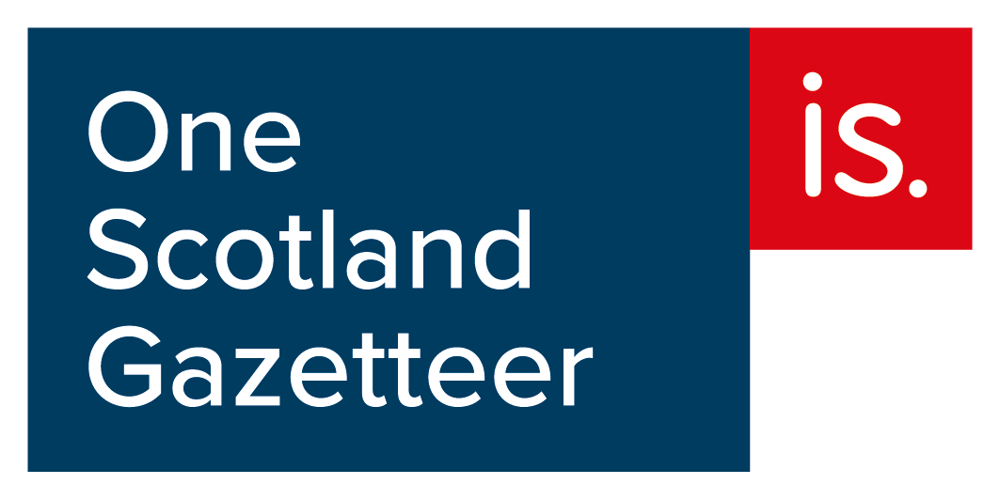

{width=675px}

#### `r params$council` Gazetteer

#### OSG Performance and Health Check Report 6 
### `r params$date`

<br>  
<br>  
<br>  
<br>  
<br>  
<br>  
<br>  
<br>  
<br>  
<br>  
<br>
<br>  
<br>  

### Improvement Service
### Avais Ijaz
### OSG Custodian

\newpage 


# Background

The Health Report will be produced and shared on a regular basis to allow local authorities & the Improvement Service to monitor progress and to help highlight trends and priorities for QA related work, this will also allow the Improvement Service to offer assistance where required. 


**The analysis is based on data submitted to the OSG portal over a 4 week period between Aug- Sept 2022 so any subsequent changes made to the data will not be detailed here.**

Each local authority submits their gazetteer to the Data & Intelligence team at the Improvement Service where the data is validated and shared with partners either directly or via a 3rd party. The data is also available via the One Scotland Gazetteer portal which currently receives over 4 million address searches a year, this in turn also generates a significant number of OSG portal requests whereby users can flag up queries relating to address data.  


## Some key Gazetteer benefits:

*	More efficient public services through centralised information source
*	Access to the most comprehensive and up-to-date addressing dataset in Scotland
*	Robust change feedback mechanism for user confidence
*	Access to the status of a property and important dates in its lifecycle

# News Roundup

## KHub Relaunch!

The [Knowledge Hub](https://khub.net/group/onescotlandgazetteercustodians/group-forum/-/message_boards/message/365257954?_com_liferay_message_boards_web_portlet_MBPortlet_showBreadcrumb=false) has been refreshed and everyone is encouraged to take the time to familiarise themselves with the new layout. If you are new to the Gazetteer community please have a read through the forum to see what the community has been discussing recently. You may have missed out on conversations relating to [Street Naming & Numbering](https://khub.net/group/onescotlandgazetteercustodians/group-discussion/-/message_boards/message/705520643) issues, [Enforcement action](https://khub.net/group/onescotlandgazetteercustodians/group-discussion/-/message_boards/message/703534729) or the [proposed validation changes](https://khub.net/group/onescotlandgazetteercustodians/group-discussion/-/message_boards/message/519046324) to Streets and Organisation names. 

## Gazetteer Training 

The Improvement Service is once again offering free training via Idox to all gazetteer custodians. The training will cover both the Address & Streets side of the GMS module and will take two full days. The Improvement Service will also supplement this with a one day “Refresher” course which is aimed at giving those already in the job a bit of background as to the legacy of the gazetteers and help highlight best practice and include discussion on the data conventions to try and help bridge any gaps in knowledge. Please get in touch asap if you have not already done so to attend any of these sessions. We are looking into providing similar sessions for both WDM & Aligned Asset users.  

## Innovation Awards

The Improvement Service is asking you to get your thinking caps on and get in touch to highlight any examples of Gazetteer integrations, all nominations will be publicised with a winner announced at the Gazetteer Community Event on the 1st of December. Regardless of how new or old your integration might be, waste collection or school travel or even using the gazetteer for mail shots or used for delivering services during the pandemic use of the CAG is of obvious benefit and we want to help highlight the great work that you help underpin. Please get in touch via Gazhelp to discuss.

## Improvement Work

A big thanks to all of you for the sterling work being undertaken to resolve OSG portal queries, PAF matching and the recent run of data uplifts to Levels, BLPU State & Classifications. There has been a tremendous effort by you all which has helped make the gazetteers a closer reflection of the real world and has seen data quality levels rise to a new high. As per discussions taking place at the Summer Catch up sessions (which have now run into autumn) councils are being asked to give thought to what current CAG integrations could be refreshed with API connections to replace the old file import routines as well as looking for new integration possibilities for legacy or newly purchased systems. 

\newpage

# Data Analysis

## Type A Data Uploads
Data currency is one of the key components of the Gazetteer due in part to the dependency on the address data by critical consumers such as Scotland’s three emergency services along with eDevelopment & the Energy Savings Trust. With the Ordnance Survey launching more mapping products that derive data from the OSG, multiple loads of local CAG data over the course of a week to the OSG portal have become a minimum requirement. 

**Benefit** – ensures that additions & corrections to gazetteer data are more quickly shared. 

**Assistance** – The Improvement Service are working with councils to develop and implement the Cloud Connector Framework (CCF) which will enable automatic uploading of Gazetteer data directly to the OSG in an automated manner removing the dependency on local custodians manually processing an extract and uploading to the OSG.

**Recommendation** – Whilst most councils have now implemented the CCF tool there are still a number of councils yet to deploy. Councils need to ensure resources are adequately deployed to guarantee a timely implementation of the new CCF tool and that regular uploads are maintained during the transitionary phase.

```{r uploads-recent, echo=FALSE, fig.height= 4, fig.width= 7, warning=FALSE, message=FALSE}

uploads_council_group_recent_barplot(params$uploads, params$council)
```


```{r uploads-council, echo=FALSE, warning=FALSE, message=FALSE}

uploads_council_group_barplot(params$uploads, params$council)

```

The above table shows the variation of upload consistency between the councils across the region over various reporting periods.

```{r uploads-regional, echo=FALSE, warning=FALSE, message=FALSE}

uploads_regional_summary_barplot(params$uploads)
```

The above table clearly shows that multiple uploads over a short period are now the standard with most councils close to supplying on a daily basis.  

\newpage

## Classifications  

**Benefit** – The recent response to the Covid outbreak has highlighted a critical issue with Gazetteers not able to provide a wholly uniform view of the location of critical sites due to incomplete classifications and will be high on the agenda for users such as NHS, Scottish Government and colleagues in Resilience Planning. The coming Census also places a requirement to ensure that property types have a more granular level of detail, with the recent announcement of the postponement of the census to 2021 this gives councils an excellent opportunity to ensure that their data is ready in time.

**Assistance** – where required the Improvement Service can supply a file to automatically update classifications en masse.

**Recommendation** – councils to prioritise classification work and implement update to classifications if this is still outstanding.

```{r, echo = FALSE, warning = FALSE, message = FALSE}
scot_average <- class_data %>% 
  filter(Measure == "tertiary") %>%
  group_by(Date, Measure) %>% 
  summarise(Value = round(mean(Value),0)) %>%
  arrange(desc(Date)) %>%
  pull(Value)

last_period <- scot_average[2]
this_period <- scot_average[1]

```

The overall picture for Scotland is still an upward trajectory with most councils having increased their tertiary level classifications moving Scotland’s average from the previous figure of `r last_period`% to `r this_period`%.

```{r class-single-council, echo=FALSE, warning=FALSE, message=FALSE}

class_single_council_stacked(params$classifications, params$council)
```

The table below demonstrates that progress is being made by other regional groups as councils all seek to improve the quality of their property classifications, thereby steadily increasing the overall average of Scotland. 

```{r class-regional, echo=FALSE, warning=FALSE, message=FALSE}

class_region_summary_barplot(params$classifications)
```

```{r class-council, echo=FALSE, warning=FALSE, message=FALSE}

class_council_group_barplot(params$classifications, params$council)

```

\newpage  

## Breakdown by Error type  

**Benefit** – this will allow councils to focus and plan targeted improvements.

**Assistance** – the Improvement Service can work in conjunction with custodians to assist and provide guidance where required.

**Recommendation** – custodians need to ensure that data meets the current validations and keep error levels to within the national average.

Due to recent changes in validations custodians will see a notable shift in overall error numbers & error types.

```{r errors-council, echo=FALSE, warning=FALSE, message=FALSE}

errors_council_group_barplot(params$errors, params$council)
```

```{r errors-regional, echo=FALSE, warning=FALSE, message=FALSE}

errors_region_summary_barplot(params$errors)
``` 
\newpage  

## Postal Address File (PAF) Matching  

**Benefit** –Having an accurate match to Royal Mails PAF increases the confidence in the address data and prevents issues with undeliverable mail.

**Assistance** – The Improvement Service can offer to assist with any outstanding legacy matching.

**Recommendation** – Each council must ensure that the monthly PAF matches are reviewed and returned to avoid adding to any unmatched legacy data. 

```{r paf-council,echo=FALSE, warning=FALSE, message=FALSE}
paf_council_group_barplot(params$paf, params$council)
```

```{r paf-region,echo=FALSE, warning=FALSE, message=FALSE}
paf_region_summary_barplot(params$paf)
```

\newpage 

# OSG Portal Queries
Non local authority users of gazetteer data include the Scottish Emergency Services, National Records of Scotland, Scottish Government and members of the public. The OSG website provides users an online facility to quickly and easy log a query relating to possible address errors, positional inaccuracy & incorrect classifications etc. This is also one of the best ways to get feedback on gazetteer quality via 3rd party users but it’s equally important to ensure that these queries sent from the OSG Helpdesk are answered promptly to ensure trust in gazetteer data is maintained.

All outstanding OSG portal requests are being collated & reported on including those calls logged but have never closed off.

## Recommended Remedial Actions 
Based on the data within the report the following actions are recommended:


